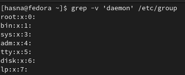

 ###  Display a list of all the users on your system who log in with the Bash shell as a default.
`grep '/bash$' /etc/passwd | cut -d: -f1`

 ###  From the /etc/group directory, display all lines starting with the string "daemon".
`grep "^daemon" /etc/group`

  ###  Print all the lines from the same file that don't contain the string.
`grep -v "daemon" /etc/group`

 ### Display localhost information from the /etc/hosts file, display the line number(s) matching the search string and count the number of occurrences of the string.
`grep -n "localhost" /etc/hosts`

### Display a list of /usr/share/doc subdirectories containing information about shells.
`find /usr/share/doc -type d -name "*shell*"`

### How many README files do these subdirectories contain? Don't count anything in the form of "README.a_string".
`find /usr/share/doc -type d -name "*shell*" -exec find {} -type f -name "README" \; | grep -v "README.a_string" | wc -l`

### Make a list of files in your home directory that were changed less that 10 hours ago, using grep, but leave out directories.
`find ~/ -maxdepth 1 -type f -mmin -600 -exec ls -l {} \; | grep -v "/$" `

### An alternative for wc -l using grep is :
`grep -c ""`

### 9. 

### Display configuration files in /etc that contain numbers in their names.

