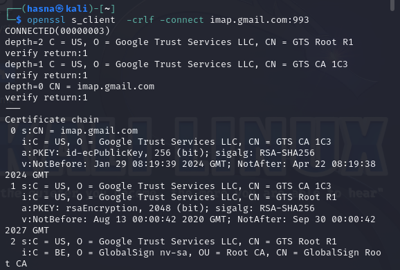

### Using openSSL to gain access to IMAP mail server (Google's Gmail)

#### Connect
`openssl s_client -crlf -connect imap.gmail.com:993`

#### Login
generation of a new password

then login success

### List Mailboxes:

### Select a Mailbox:

### Mailbox Status:

### Fetch Headers of Last Ten Messages:

### Fetch Message Body:

### Logout:
 

## HTTP :

### Sending an HTTP Request using Telnet :

We test with a GET / HTTP/1.1 

### Intercepting an HTTP Request using Netcat :
we configured mannually the proxy in the browser

running

### HTTP/1 vs HTTP/2
##### Request Processing:

HTTP/1: Processes one request at a time per connection, leading to potential latency issues due to the need to establish multiple connections for fetching multiple resources.
HTTP/2: Introduces multiplexing, allowing for concurrent requests and responses over a single connection, reducing latency and improving resource utilization.
##### Data Transmission:

HTTP/1: Transmits data as plain text, including headers, leading to increased overhead.
HTTP/2: Implements header compression, reducing the amount of data sent over the network by compressing headers, thus improving efficiency and reducing overhead.
##### Connection Handling:

HTTP/1: Requires establishing a new connection for each resource, leading to increased connection overhead.
HTTP/2: Supports one connection per origin, reducing the need for multiple connections and improving performance.
##### Server Push:

HTTP/1: Relies on the client to request resources explicitly, leading to potential delays in fetching dependent resources.
HTTP/2: Introduces server push, where the server can proactively send additional resources to the client without waiting for explicit requests, improving page load times by reducing round trips.
##### Binary Protocol:

HTTP/1: Text-based protocol, which can be inefficient for data transmission.
HTTP/2: Binary-based protocol, more efficient for parsing and transmission, contributing to improved performance.

