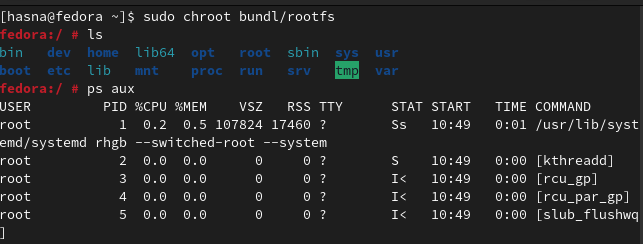
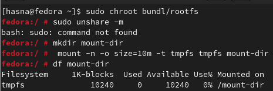
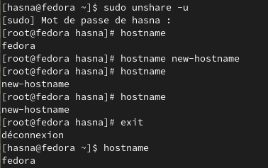
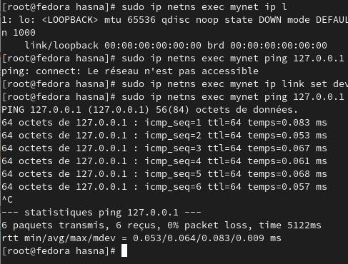
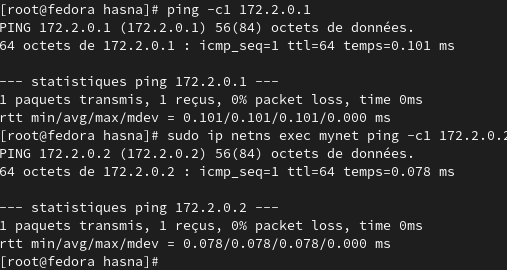
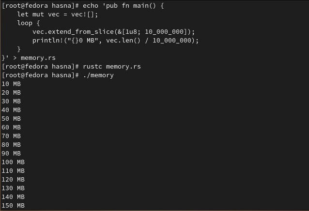

# Creating a jail from OCI image

## Chroot

## Skopeo & Umoci
 ###### Skopeo (downold OCI image) & Umoci (unpack the image)

 ###### we can now chroot via :

### Network
 
- Processes inside the chroot environment were able to interact with processes and network devices outside the jail. No isolation
 
 
## Namespace

- UTS
nothing has changed because the changes made within the user namespace do not propagate to the parent namespace or the system level--

- pid namespace

- network namespace

- new network namespace called mynet using ip

- Upping the network

- create a veth pair which should allow communication 

- veth0 & veth1 are associated automatially , now we're linking them to our namespace

- Giving addresses-

- Communicating in both directions --

#####  userId

## Cgroups

- Assign PID to a cgroup

- the PID will be killed because of the set memory constraints--

- new namespace for demonstration

## Demo 

