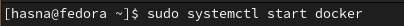
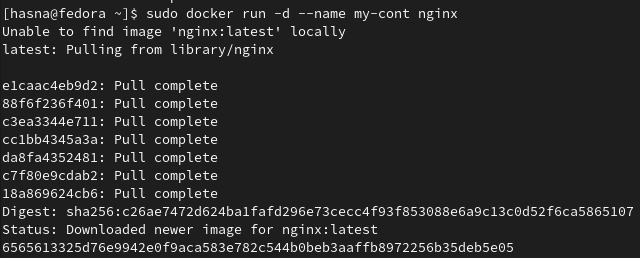
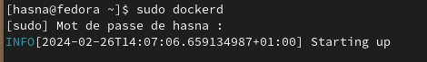
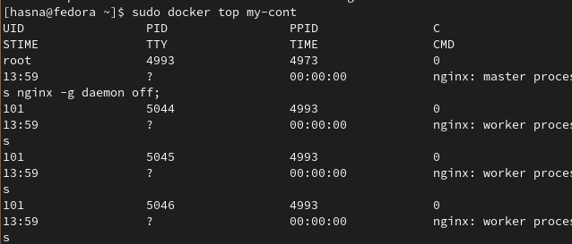
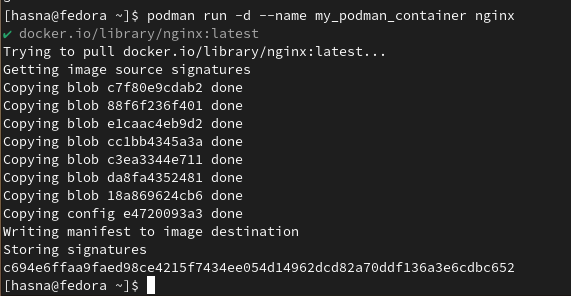
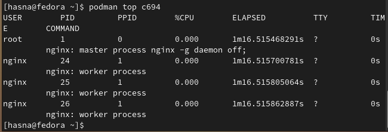
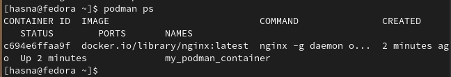

### Run Docker Container:

### Explore the running processes on the host

--dockerd--

--my-cont container to see all the process running in the container -- 

### Run Podman

### Explore podman with top

### ps

