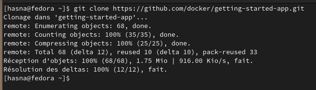
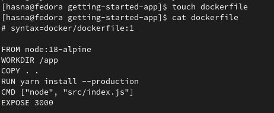
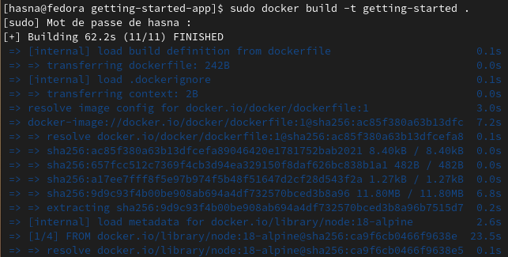
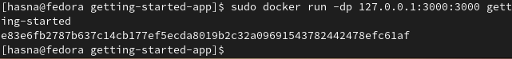
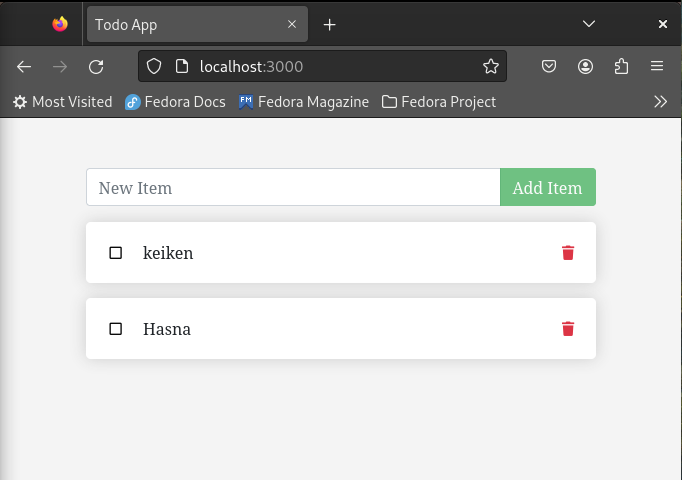
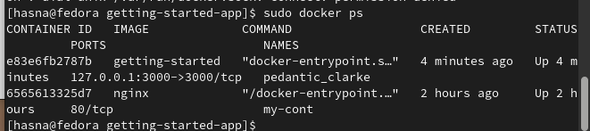

# Get the app

#### clonning the app

#### view

[alt text](images/g2.png)

# Build the app's image

- dockerfile 

- docker build -t getting-app .

# Start an app container

- todo app in the localhost:3000

- docker ps 

