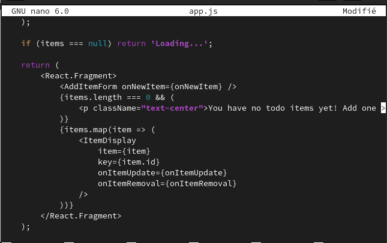
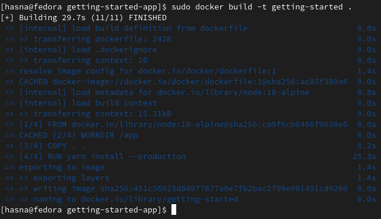
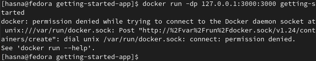
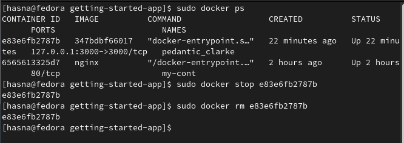
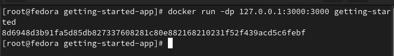
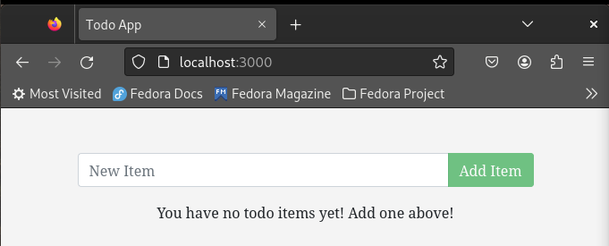

# Update the application
-  Update source code

 

 - Build the updated version

 

 -error running at the saame port :3000 

 

 # Remove the old container
 - docker ps / stop the container with its ID / remove the image

# Start the updated app container

- localhost:3000
