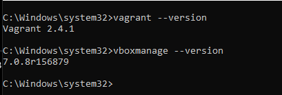
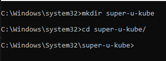
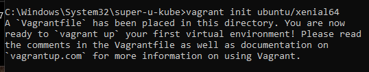
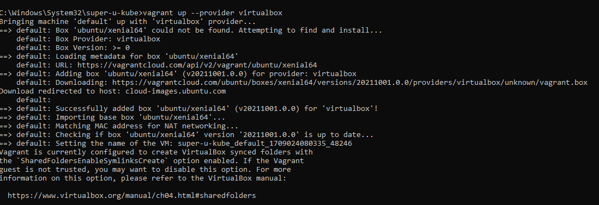
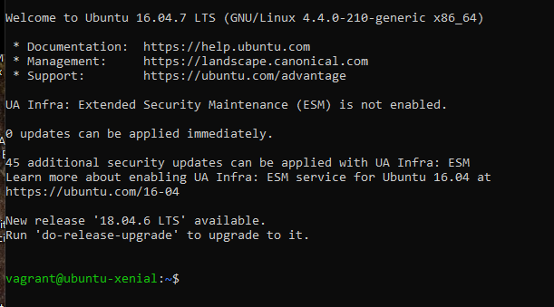
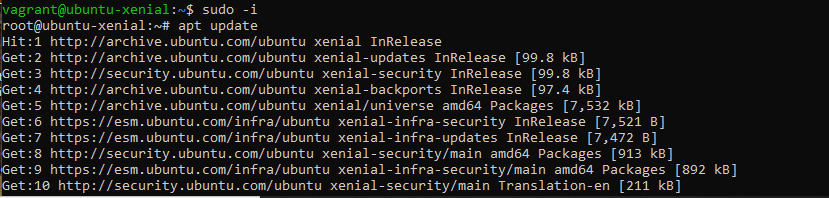
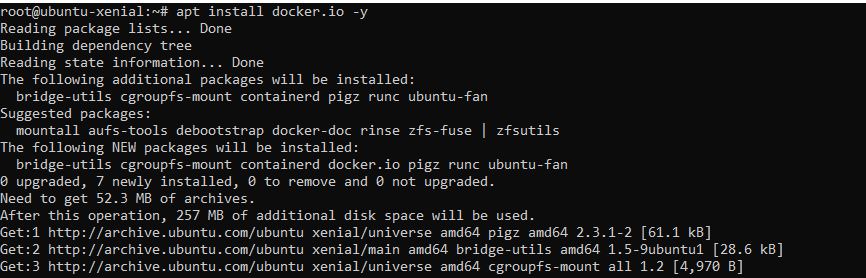
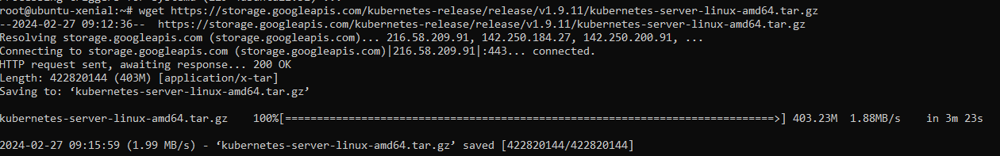
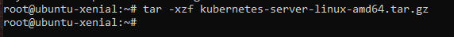
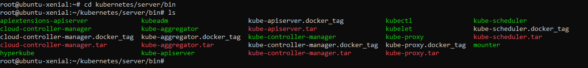

# 
#### Version check

#### Create a Folder named super-u-kube

#### Vagranfile

#### Booting in vbox

#### vagrant ssh t get into the machine

#### root priviliges & update

#### install docker with the package manager apt

#### install kubernetes binaries in the VM

#### Extract the binaries

#### kubernetes bins

