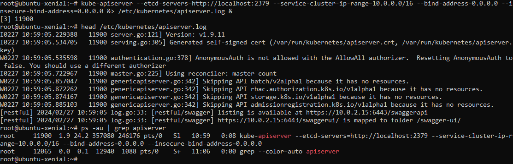
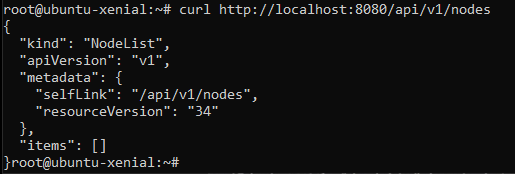
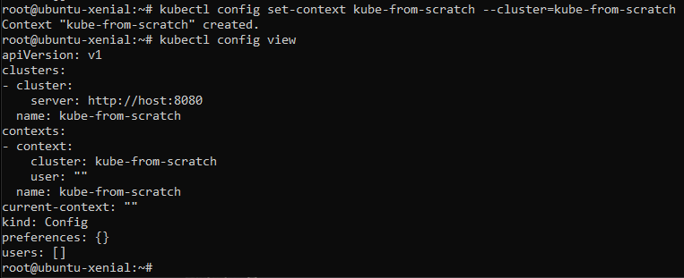
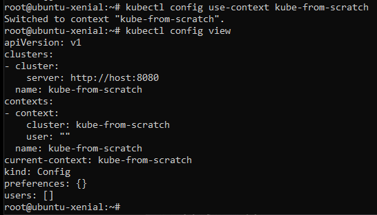
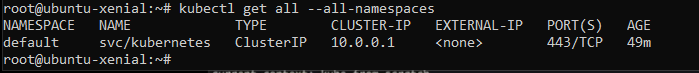

### Api Server installation

- Installation and checking that the apiserver is running

- No nodes is yet installed in the cluster 

#### sets a cluster named cluster-from-scratch 

- Setting a context for the cluster :
### reminder:
 Contexts in Kubernetes help you manage different cluster settings easily so you can effortless via kubectl.

- we have now a context linked to a user linked to a cluster linked to a server

-   we fetche details about all resources in all namespaces 

