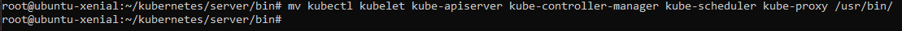
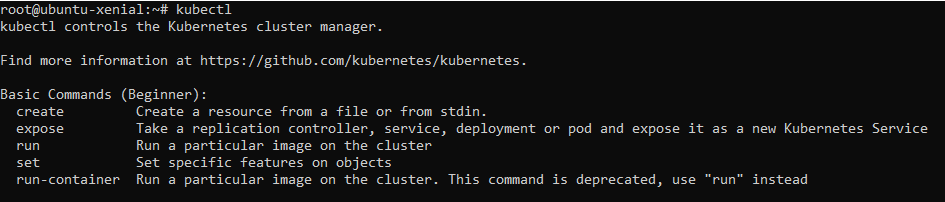
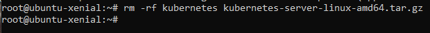
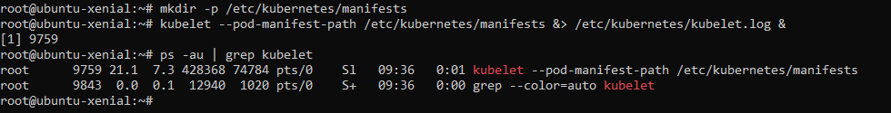
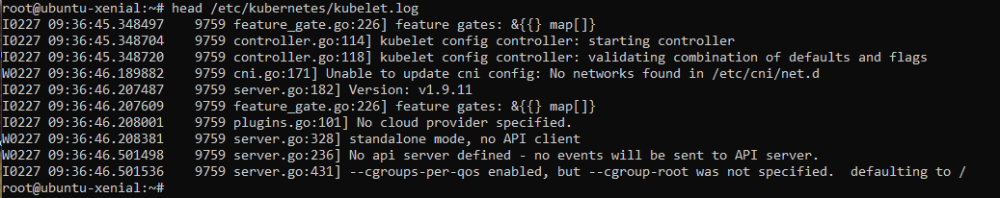
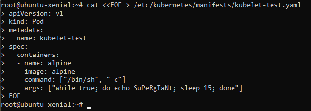
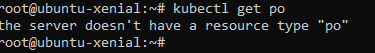
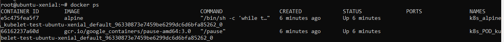
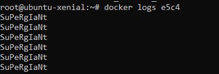

#### mouving k8s into usr/bin/

- accessible from our home 

#### For clean directory, Remove the unecessary.

#### manifest for kubelet

#### check the logs for kubelet (running the kubelet in a standalone mode)

- Reminder : Running kubelet in a standalone mode allows for the deployment and management of Kubernetes nodes that are not part of a larger cluster.

#### Kubernetes pod : kuberlet-test

- we cannot call the pod with kubctl because we don't have an API server setup for the moment 

- So we go to docker & check the running containers

- the pod is doinng its job by "echo-ing" supergiant every 15 

