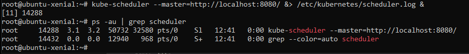
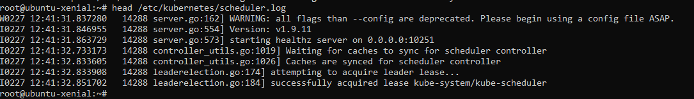
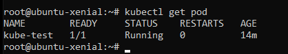
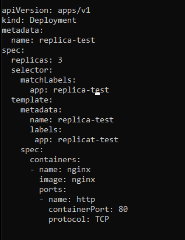
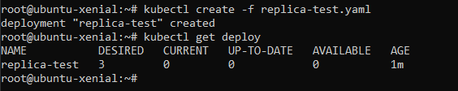
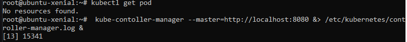
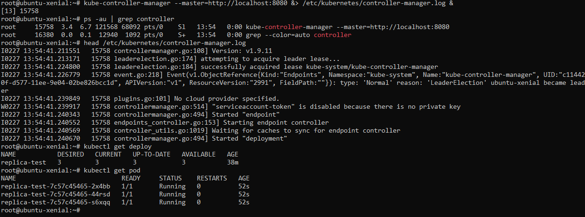

### Scheduler
 - we need the scheduler in order to assign the pods to the nodes based on ressources.

- the scheduler is created

- no unexpected errors

 

 - the pod now is running 
because of the installation of the scheduler

- this is the new pod inside a replica-test file

- created

- we create a controller manager 
 #### Reminder: 
 the Kubernetes Controller Manager is responsible for managing various controllers within the Kubernetes cluster, and always checks if the actual state is equal to the desired state.

- setup the controller manager 
- the pods is running

