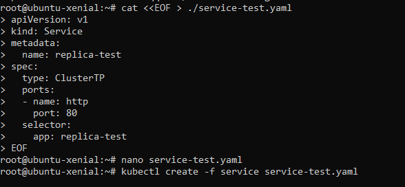
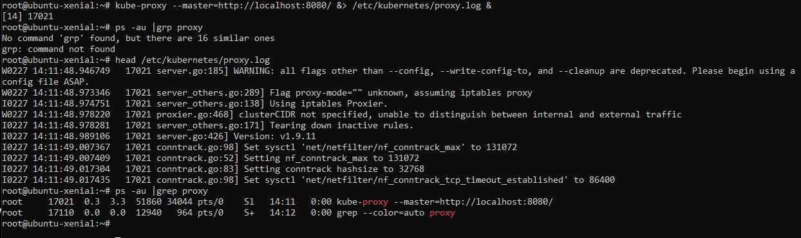
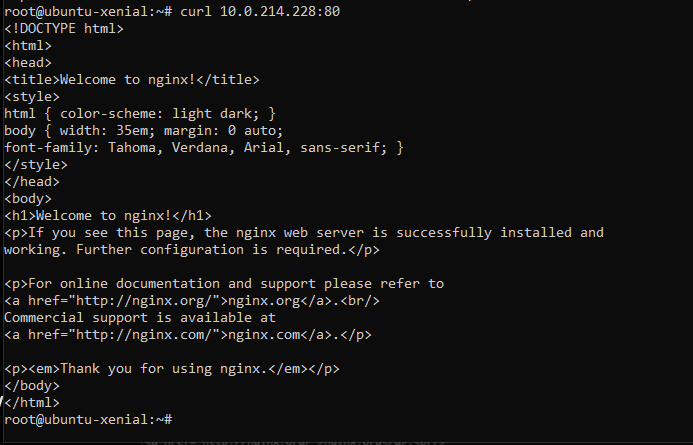
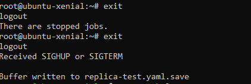

### Service
- creation of service

### kube-proxy for networking

we cannot map a cluster ip to the port 80 without kube-proxy

- now after installing the kuber proxy : welcome to nginx !

 ### END
