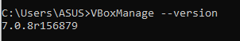
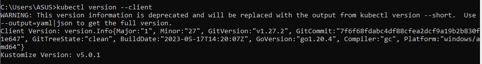
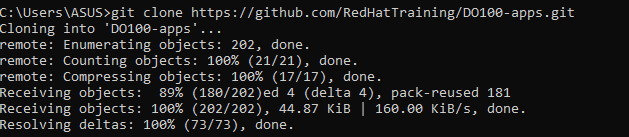
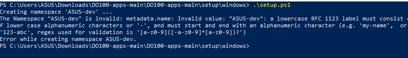

## Guided Exercise1: Contrasting Kubernetes Distributions

- virtual box is installed.

- verifying the installation

## Guided Exercise 2: Connecting kubectl to Your Cluster

- Installing kubectl in Windows

- Downloading the DO100-apps repository using Git

-  Connecting kubectl to the Kubernetes cluster

    the problem occurs while executing the script so i couldn't not change thee name
    

## Guided Exercise3: Running and Interacting with Your First Application

