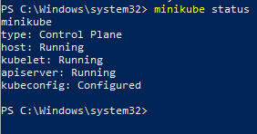

## Guided Exercise1: Contrasting Kubernetes Distributions

- virtual box is installed.

- verifying the installation

## Guided Exercise 2: Connecting kubectl to Your Cluster

- Installing kubectl in Windows

- Downloading the DO100-apps repository using Git

-  Connecting kubectl to the Kubernetes cluster

#### PROBLEM !

- The problem happens when running the script DO100 setup. Even though I changed the username from "ASUS" to another one and also tried using username.ToLower() in the script, it still doesn't work during execution.

- if u have this probleme try to lowercase ur name by changing the first line of setup.ps1 to `$USERNAME = $env:USERNAME.ToLower()`

## Running and Interacting with Your First Application
 - pod created

 

 - Deployement created

## Executing Commands Within an Existing Pod

## Deploying Managed Applications
- create a deployement

- this command contains run time information about the deployment

### Networking in k8s

- create a service "svc" and expose the port :

