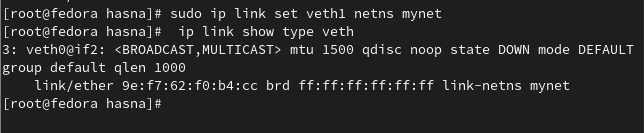

# Creating a jail from OCI image

## Chroot

## Skopeo & Umoci
 ###### Skopeo (downold OCI image) & Umoci (unpack the image)

 ###### we can now chroot via :

### Network
 

 -- Processes inside the chroot environment were able to interact with processes and network devices outside the jail. No isolation --
 
 
## Namespace

-UTS-
nothing has changed because the changes made within the user namespace do not propagate to the parent namespace or the system level--

pid namespace

network namespace

new network namespace called mynet using ip

Upping the network

-- create a veth pair which should allow communication --

veth0 & veth1 are associated automatially , now we're linking them to our namespace

-Giving addresses-

-- Communicating in both directions --

#####  userIdù

## Demo 

